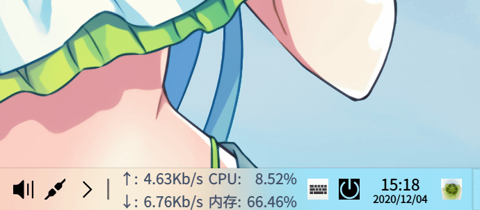

# lfxSpeed
<p align="right"><br><a href="README.md">English</a> | <a href="README.zh_CN.md">简体中文</a> | <a href="README.zh_TW.md">繁體中文</a></p>

      

     

<br>

一款轻巧、快速的网速插件。（**建议使用重构版本：[NetSpeed](https://github.com/xmuli/NetSpeed)** ）



<br>

## 目录

- [背景](#背景)
- [编译](#编译)
- [卸载](#卸载)
- [作者](#作者)
- [其它](#其它)
- [协议](#协议)

<br>

### 背景

认为`DDE` 环境桌面很漂亮， `Deepin` 爱好者，同时也是开发者之一，看习惯了在其他系统上有一个任务栏网速插件，但此 `Deepin v20 / UOS v20`上没有，于是便有了这个项目。此适用于 `DDE` 桌面环境的 `Linux` 发行版、如 `Deepin / UOS `上。
   
<br>

### 编译

采用 `cmake` 构建，进入源码目录后，执行如下：

```bash
mkdir build && cd build
cmake ..
make -j16
sudo make install
```

或直接使用 `IDE` 点击构建按钮（非运行按钮），然后手动复制共享库： `sudo cp liblfxSpeed.so /usr/lib/dde-dock/plugins` ；

<br>

**注意：** 若未生效，可执行 `killall dde-dock` 重启任务栏后生效

**开发文档：**   [ifmet.cn](https://ifmet.cn/posts/c225b552) or [link](https://xmuli.blog.csdn.net/article/details/110672252)

<br>

### 卸载

任意路径下执行如下：

```bash
sudo rm -rf /usr/lib/dde-dock/plugins/liblfxSpeed.so
```

<br>

### 作者

[偕臧](https://github.com/xmuli)

<br>

### 其它

此项目不再维护；但基于其思路和新的实现目标，源码将会重新设计实现，一个功能更加强大的网速插件，也会提供对应的库便于后来者二次开发，新的项目在 [NetSpeed](https://github.com/xmuli/NetSpeed) ，芜湖～

<br>

### 协议


该项目基于 `MIT` 协议进行分发和使用。 有关更多信息，请参阅 [协议文件](/LICENSE)。


