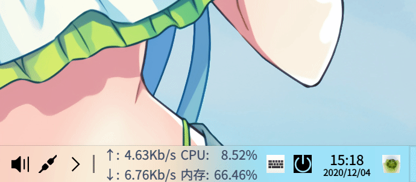

# lfxSpeed
<p align="right"><br><a href="README.md">English</a> | <a href="README.zh_CN.md">简体中文</a> | <a href="README.zh_TW.md">繁體中文</a></p>

一款輕巧、快速的網速外掛程式。



<br>


## 目錄

- [背景](#背景)
- [編譯](#編譯)
- [卸載](#卸載)
- [維護者](#維護者)
- [許可協議](#許可協議)

<br>

### 背景

認為`DDE` 環境桌面很漂亮， `Deepin` 愛好者，同時也是開發者之一，看習慣了在其他系統上有一個任務欄網速外掛程式，但此 `Deepin v20 / UOS v20`上沒有，于是便有了這個項目。此適用于 `DDE` 桌面環境的 `Linux` 發行版、如 `Deepin / UOS `上。

<br>

   

<br>

### 編譯

採用 `cmake` 構建，進入源碼目錄後，執行如下：

```bash
mkdir build && cd build
cmake ..
make -j16
sudo make install
```

<br>

或直接使用 `IDE` 點擊構建按鈕（非運行按鈕），然後手動複製共用庫： `sudo cp liblfxSpeed.so /usr/lib/dde-dock/plugins` ；

**注意：** 若未生效，可執行 `killall dde-dock` 重啟任務欄後生效

**開發文檔：**  [Deepin 開發任務欄網速外掛程式 lfxSpeed](https://xmuli.tech/posts/c225b552/) or [link](https://xmuli.blog.csdn.net/article/details/110672252)

<br>

### 卸載

任意路徑下執行如下：

```bash
sudo rm -rf /usr/lib/dde-dock/plugins/liblfxSpeed.so
```
<br>


### 維護者

[@偕臧](https://github.com/xmuli)

<br>

### 其它：

此項目不再維護；但基于其思路和新的實現目標，源碼將會重新設計實現，一個功能更加強大的網速外掛程式，也會提供對應的庫便于後來者二次開發，新的項目在 [lfxNet](https://github.com/xmuli/lfxNet) ，蕪湖～

<br>

### 許可協議

 [MIT](LICENSE) © xmuli <偕臧>
